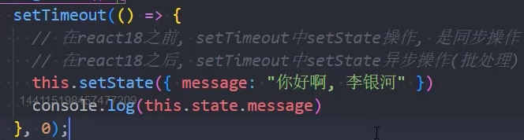

<h3> 为什么使用setState

因为react没进行数据劫持，需要自己设置，我们需要通过serState来告知数据改变

继承component 就会有setState方法

方法一 传入对象

this.setState({})) 直接设置对象

方法二 传入回调函数

好处一： 可以在回调函数中编写新的state的逻辑

好处二： 当前获取之前的state和props值

this.setState((state,props)=>{

    可以获取，state和props

    return {

    message："新值"

    }

}))

方法三 setState在React的事件处理中是一个一异步调用

this.setState({message:"你好"},()=>{

    

})

**setState是一个队列结构**

**优点**

性能更优，显著提升性能，

可以将多数更新，集合成一次更新

假如是同步更新state，但是还没执行render函数，那么state和props不能保持同步

修改state 需要重新执行render函数，会导致数据不同步，子组件显示的还是旧值

在react18之前  settimeout(()=>{

    this.setState({message:"你好"})

},0)

为同步代码

将setstate设置为同步

import { flushSync} from "react-dom"

flushSync(()=>{

    this.setState({message:"你好"})

})
